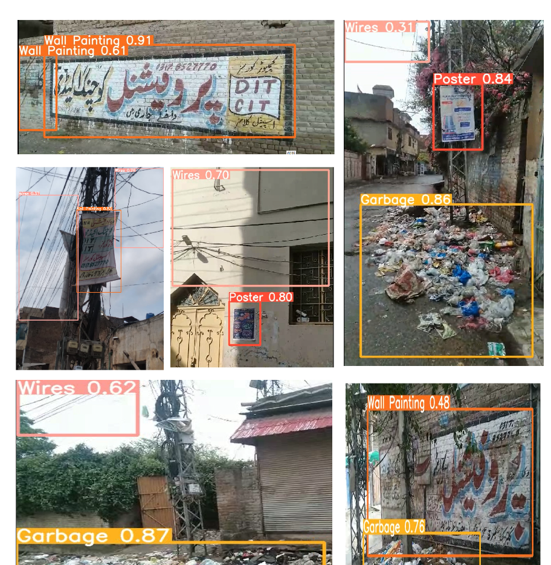

## Visual Pollution Detection

This project focuses on detecting visual pollution in images, which includes classes like wall chalking, wire clusters, posters, garbage, and an additional small class for graffiti. The dataset used contains **1,570 images**, and four different models were tested for performance. **YOLOv9** provided the best results in terms of precision and recall.

The following models were tested:
- YOLOv9
- YOLOv8
- MobileNet-SSD
- EfficientDet

The goal was to identify and classify different types of visual pollution to help improve urban aesthetics.

### Results

### Project Demo

Here’s a demo of how the model works:

<iframe width="560" height="315" src="VIDEO5.mp4" frameborder="0" allowfullscreen></iframe>

